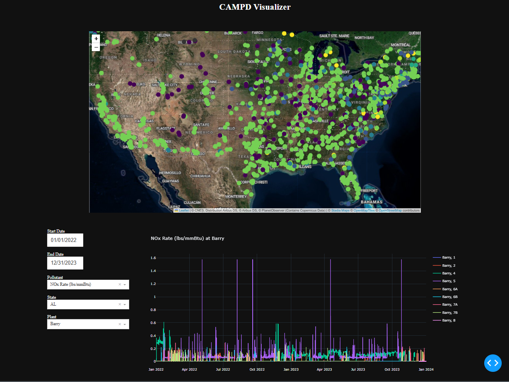

# Overview

This repository contains everything you need to download and visualize the data
collected under the 1990s Clean Air Act. This act had to do with combating acid rain,
and the act requires all fossil-fuel burning plants above a certain (small) size to
report hourly emissions data to the US Environmental Protection Agency (EPA).

The purpose of this repository is to show people things I learned about working with
medium to large datasets. In particular, I'll show how to obtain the raw data as csvs,
create a parquet dataset, query it with `SQL` using `duckdb`, and build a visualization
dashboard using `Plotly Dash`.

The EPA maintains and makes public this data [here.](https://campd.epa.gov/data) They
have an [API](https://github.com/USEPA/cam-api-examples) that makes this data available
through a website GUI and also through scripts, and it's where I started when writing
the downloading script that is used here.

As a disclaimer, I'll mention that while I work at the EPA in a group that deals
directly with this data, everything I write here is as a public citizen and reflects
neither the views nor work of the EPA in any way.

# Required Software

You'll need `python` installed, and `conda` to create the environment I use. On Linux,
you need at least 8GB of RAM, I'd up that to 16GB for Windows. I primarily use Linux, so
I know all this works pretty well there. I tested this in Windows, but not all that
much.

You will also have to install this python package as well so that python knows where to
look to execute the import statements. You can do this by navigating to the root
directory, the one with `setup.py`.

Create and start the python environment with

    conda env create -f campd_visualizer.yml
    conda activate campd_visualizer

Then, run

    pip install -e .

before proceeding to the code below.

# Getting the Data

The data is made public in uncompressed `csv` files. This is a poor choice, as the
entirety of the data totals to about 200GB, which is only 9GB when zipped. Therefore,
the script located in

    campd_visualizer/scripts/get_campd_data.py

downloads the quarterly data as `csv` files and immediately compresses them into `zip`
files, so that you will never need 200GB of free space on your hard drive. To run it,
you will need to apply for a key
[here.](https://www.epa.gov/airmarkets/cam-api-portal#/api-key-signup) It should only
take minutes to get the key in your email. Place whatever that string is into a file at
`keys/camd_key`.

This will take about 8 hours, and on Windows, it kept crashing so I had to keep
rerunning it.

The data about the power generation facilities is also made available through yearly csv
files, which are downloaded in the same manner.

A comment on how the download script is implemented: I check the modification time of
the local zip file, if it exists, and compare it with the "last updated" time of the
corresponding quarterly csv on the EPA server. If and only if the file on the server is
more recent than your local file, it will download the file. This means that if you run
the script after it completes succesfully, it should download nothing. This makes it
easy to update your dataset when the EPA updates the quarterly data, as it periodically
does even for data from several years ago. This approach isn't bulletproof, as if you
manually change the file somehow, you will change its timestamp, and the script may
incorrectly conclude that you don't need to update the data. I suppose if you really
wanted to be precise, you could store the download time in a file for each quarterly csv
so it can't be accidentally changed if you muck about with the files. But I am okay with
this.

Another consideration is that if the download is interrupted and only partially
downloaded, checking the timestamps alone may not be a reliable way to ensure you have
all of the data. In the case that a download is interrupted, I would suggest you delete
the last downloaded file and run the download script again.

# Considerations for Selecting the Parquet Data Format

After the data is downloaded, there is a question about how it should be accessed.
Perhaps most simply, one could read the files using the `pandas` library, as it can even
read files compressed with zip. But this is a poor choice. `pandas` typically loads the
data into memory, which is not practical for large datasets. Further, with the data
spread out over so many quarterly csvs, it would be a pain to figure out which files are
relevant.

An SQL database would offer some advantages here. By loading all of the quarterly data
into a single SQL table, we could conveniently query it to get whatever data we wanted.
And because such databases are memory-efficient, we wouldn't be loading things into RAM
unnecessarily.

However, such databases are annoying to install and setup. As far as my experience goes,
when I built an `sqlite` database of this data, the database itself was close to 200GB
in size, the same as the uncompressed `csv` files. Further, `sqlite` is somewhat poorly
setup to handle data as large as this, missing features to efficiently import data into
a database table, and lacking the option to perform indexing on the table. SQL indices
serve as metadata that is used so that all of the data doesn't need to be looked at to
return query results. While `postgresql` has more possibilities for optimization such as
indexing, the database was still 200GB in size. This is really quite an unattractive
situation.

SQL databases are also in some sense overkill, because for data analysis tasks we are
not typically going to change any of the data. So all of the infrastructure that SQL
databases have to facilitate write operations are of no use.

A popular modern approach to this situation is to use parquet files. These are basically
meant for read-only applications, and this might be what allows them to compress the
data. In particular, the entire dataset is brought down to about 5.6GB. It achieves this
by storing a table not as a series of rows, but as columns, which allows for more
straightforward compression. It also keeps metadata in each of it's files, referred to
as row statistics, which help the parquet reader to know whether a query needs any of
the data in the file or not. This is analogous to an SQL index, but parquet does this
automatically. Still, when you know that queries will occur along certain dimensions,
say Year or State, you can manually specify these columns as partition column(s). So if
you partition on the Year column, for example, the parquet data format will break your
data which spans over N years into one or more files in N separate subdirectories. So
for queries asking for data in 2003, for example, would only read the files in the
subdirectory `Year=2003`, and parquet readers can intelligently leverage this
information. The most common implementation of this is called Hive Partitioning. The
name "Hive" is probably an arbitrary historical artifact.

To complete the case for using parquet files, observe that you can actually issue
standard SQL queries to a parquet dataset through a popular tool called `duckdb`. And so
for the user, there is very little difference getting data from an SQL database or from
a parquet dataset. There seems to be no performance loss using `duckdb` and parquet
files either. And we can have all this without having to deal with oversized files. I
believe this is a winner, so I'll show you how to make this dataset.

# Preparing the Data for Analysis and Visualization

After downloading the data, run

    campd_visualizer/scripts/concatenate_facilities.py

to create the "all_facilities.csv", which is merely a concatenation of all of the
facility data. Then, run

    campd_visualizer/scripts/zip2parquet.py

to create a parquet dataset with the data partitioned by year. How long it takes depends
on your hardware, so maybe 10min to an hour. 
But the parquet dataset is itself not really a
unique end point. What I mean is that although the data has been partitioned by year
into different folders, the data could still be split into a different number of
files, and those files could be subdivided into different numbers of so-called `row-groups`. A parquet reader would now need to look at each of these files, examine the
metadata, and decide whether or not it needs to be read, and if so, use row-group metadata to find which row-groups to read. So there is a
cost to having files that are too small, because all of these decisions increase. On the other hand, there is a cost to having
the data in too few files, because in that case a larger file must be opened up and
examined, and if only a little bit of data is needed, there can be a lot of wasted
effort.

So a balance is needed. I read somewhere that the individual files should probably be
between 20MB and 2GB. When this dataset is partitioned by Year alone, the directory
contains about 300MB of data, which can comfortably fit in a single file. If we
paritioned by Year and by State, this would create about 1500 files, each about 6MB or so. For
this reason, I partition only on Year. But because almost every query 
filters on State, I would guess that this case should be an exception to the general rule? 
It's worth benchmarking somehow, but I probably won't get to that. And there are some annoying
OS issues if you try and open more than 1024 files, so I'll stick to partitioning on Year alone.

# Running SQL Queries on the Parquet Dataset

I have a included a `python` and `R` script that show you how to issue an `SQL` query to
the parquet dataset. They are located here, and you can tinker with them if you like:

    campd_visualizer/scripts/duckquery.py
    campd_visualizer/scripts/duckquery.R

# Visualize the Data

With the dataset built, you can navigate to

    campd_visualizer/visualizer/app.py

and run it. The output will give you a link to open the dashboard in the browser. Have
fun exploring. 

Please treat the dashboard as a mere starting point; any competent data
scientist would use such a tool and customize it for whatever kind of analysis is at
hand.

You may be able to learn some things from the `Dash` app. The callbacks take some
experience getting used to if you've never done anything like it before. I'm alright
with the implementation so far.
